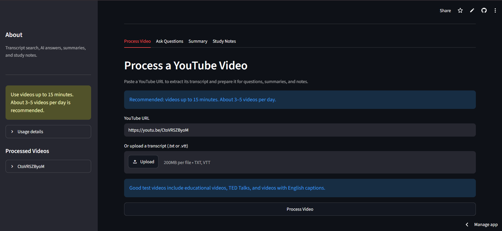

# VideoMind AI

An AI-powered Retrieval-Augmented Generation (RAG) learning assistant that transforms YouTube video transcripts and uploaded caption files into searchable educational knowledge. VideoMind AI uses semantic retrieval and Groq-powered language generation to provide contextual answers, summaries, and structured study notes through an interactive Streamlit dashboard.

### Live demo : "https://videomind-ai-m1707.streamlit.app/"

## Dashboard Overview



The dashboard provides an intuitive interface for processing videos, asking questions, generating summaries, and creating study notes.

## Project Overview

VideoMind AI is a portfolio project designed to demonstrate RAG principles and AI integration. It helps users:

- Extract and process YouTube video transcripts
- Ask contextual questions about video content
- Generate concise summaries of video material
- Create structured, downloadable study notes
- Perform semantic search across transcript content
- Work with transcript uploads when YouTube access is unavailable

## Problem Statement

Traditional video learning can be inefficient. Users often need to:

- Rewatch sections to find specific information
- Manually take notes while watching
- Search through transcripts without semantic understanding
- Export learning materials in multiple formats

VideoMind AI solves these problems by providing instant access to video content through natural language queries, automated summaries, and structured study materials.

## Key Features

- YouTube transcript extraction with fallback to manual transcript upload
- Support for multiple transcript formats (TXT, VTT)
- Semantic search using Sentence Transformers embeddings
- RAG-based question answering with Groq API
- Automatic summary generation
- Structured study note generation
- Multi-format export (TXT, PDF, Word)
- Free-tier compatible deployment
- Cloud-based Streamlit interface

## Technology Stack

| Component | Technology |
|-----------|-----------|
| Frontend / UI | Streamlit |
| Programming Language | Python |
| Transcript Extraction | youtube-transcript-api |
| Transcript Upload | TXT and VTT support |
| Text Processing | Python string operations |
| Embeddings | Sentence Transformers |
| Vector Database | ChromaDB |
| Metadata Database | SQLite |
| LLM API | Groq API |
| LLM SDK | OpenAI Python SDK |
| PDF Generation | ReportLab |
| Word Generation | python-docx |
| Environment Management | python-dotenv |
| Deployment | Streamlit Community Cloud |
| Version Control | Git and GitHub |

## System Architecture

```
User
 │
 ▼
Streamlit Dashboard
 │
 ├── Process Video
 │     ├── YouTube URL
 │     └── TXT / VTT Transcript Upload
 │
 ▼
Transcript Loader
 │
 ▼
Text Processor
 ├── Clean transcript
 └── Split into chunks
 │
 ▼
Sentence Transformers
 └── Generate embeddings
 │
 ▼
ChromaDB
 └── Store and search transcript vectors
 │
 ▼
RAG Pipeline
 │
 ├── Retrieve relevant transcript chunks
 │
 ▼
LLM Client (Groq API)
 │
 ├── Answers
 ├── Summaries
 └── Study Notes
 │
 ▼
Streamlit Output
```

## Project Workflow

The application follows a systematic RAG pipeline:

1. **Input Stage**: User provides a YouTube URL or uploads a transcript file
2. **Transcript Extraction**: The application retrieves transcript text from YouTube or reads the uploaded file
3. **Text Cleaning**: Formatting, whitespace, and metadata are cleaned; VTT files have timestamps and cue numbers removed
4. **Chunking**: The transcript is divided into manageable segments to prevent token overflow
5. **Embedding Generation**: Sentence Transformers converts each chunk into a semantic vector
6. **Vector Storage**: ChromaDB indexes and stores embeddings with associated metadata
7. **Query Processing**: User questions are converted into embeddings for semantic matching
8. **Semantic Retrieval**: ChromaDB identifies the most relevant transcript chunks based on semantic similarity
9. **LLM Generation**: Retrieved context is sent to Groq API for processing
10. **Output Delivery**: Generated responses are displayed through the Streamlit interface

## Folder Structure

```
VideoMind AI/
│
├── app.py                           # Streamlit dashboard and user interface
├── rag_pipeline.py                  # Coordinates the complete RAG workflow
├── transcript_loader.py             # Loads YouTube, TXT, and VTT transcripts
├── text_processor.py                # Cleans and chunks transcript text
├── embeddings.py                    # Generates semantic embeddings
├── vector_store.py                  # Stores and retrieves vectors using ChromaDB
├── database.py                      # Stores processed video information in SQLite
├── llm_client.py                    # Communicates with Groq API
├── load_data.py                     # Optional data-loading utility
├── requirements.txt                 # Project dependencies
├── .gitignore                       # Git exclusion rules
├── .env                             # Environment variables (not committed)
├── README.md                        # This file
│
├── data/                            # Processed transcripts and metadata
├── chroma_db/                       # ChromaDB vector database storage
├── dataset/                         # Sample datasets
│
└── assets/
    └── dashboard.png                # Dashboard screenshot
```

## Installation

### Prerequisites

- Python 3.8 or higher
- Git
- A Groq API key (free tier available at https://console.groq.com)

### Local Development Setup

1. **Clone the repository:**
   ```bash
   git clone https://github.com/Mahreen17/videomind-ai.git
   cd videomind-ai
   ```

2. **Create a virtual environment:**
   ```bash
   python -m venv venv
   ```

3. **Activate the virtual environment:**
   - On Windows:
     ```bash
     .\venv\Scripts\Activate.ps1
     ```
   - On macOS/Linux:
     ```bash
     source venv/bin/activate
     ```

4. **Install dependencies:**
   ```bash
   pip install -r requirements.txt
   ```

5. **Create a .env file in the project root:**
   ```bash
   GROQ_API_KEY=your_actual_groq_api_key
   LLM_BASE_URL=https://api.groq.com/openai/v1
   LLM_MODEL=openai/gpt-oss-20b
   ```

6. **Run the application:**
   ```bash
   streamlit run app.py
   ```

The application will start at http://localhost:8501

## Environment Variable Setup

Create a `.env` file in the project root with the following variables:

```
GROQ_API_KEY=your_actual_groq_api_key
LLM_BASE_URL=https://api.groq.com/openai/v1
LLM_MODEL=openai/gpt-oss-20b
```

**Important:** Never commit the `.env` file to GitHub. The `.gitignore` file should already exclude it.

## Usage Guide

### Processing a Video

1. Navigate to the "Process Video" tab
2. Paste a YouTube URL into the input field or upload a transcript file (.txt or .vtt)
3. Click the "Process Video" button
4. Wait for processing to complete (duration depends on video length)

**Supported YouTube URL formats:**
- Standard URLs: `https://www.youtube.com/watch?v=VIDEO_ID`
- Shortened URLs: `https://youtu.be/VIDEO_ID`
- Embedded URLs: `https://www.youtube.com/embed/VIDEO_ID`
- Shorts: `https://www.youtube.com/shorts/VIDEO_ID`

**Transcript Upload:**
- Maximum file size: 200MB per file
- Supported formats: .txt, .vtt
- Use manual upload if YouTube blocks your IP address

### Asking Questions

1. Navigate to the "Ask Questions" tab
2. Enter your question about the processed video
3. Click submit to receive an AI-generated answer based on the transcript

**Example questions:**
- What is the main topic of this video?
- Explain the concept discussed in the second section.
- What are the important points?
- Give an example from the transcript.

### Generating Summaries

1. Navigate to the "Summary" tab
2. Click the generate button
3. Receive a concise summary focusing on main ideas and key concepts

### Creating Study Notes

1. Navigate to the "Study Notes" tab
2. Click generate to create structured learning notes
3. Download notes in your preferred format:
   - Plain text (.txt)
   - Portable Document Format (.pdf)
   - Microsoft Word (.docx)

## Streamlit Cloud Deployment

### Deployment Configuration

1. **Connect GitHub Repository:**
   - Push your code to: `https://github.com/Mahreen17/videomind-ai`

2. **Deploy on Streamlit Cloud:**
   - Visit https://share.streamlit.io
   - Click "New app"
   - Select your repository: `Mahreen17/videomind-ai`
   - Select branch: `main`
   - Set main file path: `app.py`

3. **Add Secrets:**
   - Navigate to Settings > Secrets
   - Add the following environment variables:
     ```
     GROQ_API_KEY = "your_actual_groq_api_key"
     LLM_BASE_URL = "https://api.groq.com/openai/v1"
     LLM_MODEL = "openai/gpt-oss-20b"
     ```

4. **Deploy:**
   - Click "Deploy"
   - Application will be available at: `https://share.streamlit.io/Mahreen17/videomind-ai/main/app.py`

## Free Usage Recommendations

This project is designed to operate within free-tier limitations. Recommended usage patterns:

- **Video length:** Up to 15 minutes per video
- **Daily volume:** Approximately 3-5 videos per day
- **Questions:** 5-10 questions per video
- **Summaries:** One per video
- **Study notes:** One generation per video

These recommendations help manage CPU usage and API quota consumption on Streamlit Community Cloud and Groq free tier.

## Error Handling and Troubleshooting

### Problem: ModuleNotFoundError - torchvision

**Cause:** Missing PyTorch dependencies

**Solution:** Ensure your requirements.txt includes compatible PyTorch versions:
```bash
pip install torch torchvision torchaudio
```

### Problem: RequestBlocked - YouTube Transcript Extraction Fails

**Cause:** YouTube blocks requests from cloud-provider IP addresses (common on Streamlit Cloud)

**Solution:** Use the transcript upload feature instead. Download transcripts manually:
1. Open the YouTube video
2. Click the three dots menu
3. Select "Show transcript"
4. Click "Show full transcript"
5. Copy or export the transcript
6. Upload as .txt file in the application

### Problem: TranscriptLoader ImportError

**Cause:** Incompatible module structure

**Solution:** Ensure transcript_loader.py exports the TranscriptLoader class properly

### Problem: Git Push Rejected

**Cause:** Remote repository contains commits not present locally

**Solution:**
```bash
git pull --rebase origin main
git push origin main
```

### Problem: Streamlit Cloud CPU Throttling

**Cause:** Resource-intensive operations (PyTorch, Sentence Transformers, ChromaDB processing)

**Solutions:**
- Process shorter videos (under 15 minutes)
- Avoid repeated application restarts
- Use caching for model and client initialization
- Process fewer videos per session
- Use transcript uploads to avoid repeated YouTube requests

### Problem: Out of Memory Errors

**Cause:** Processing very long transcripts or large batch operations

**Solutions:**
- Reduce chunk size in text_processor.py
- Process shorter videos
- Limit concurrent processing requests

## Security Considerations

1. **API Keys:** Never commit API keys to version control. Use environment variables and .env files
2. **User Input Validation:** Validate YouTube URLs and transcript files to prevent injection attacks
3. **Transcript Privacy:** Be aware that transcripts are stored in ChromaDB; consider data privacy for sensitive content
4. **Rate Limiting:** Implement rate limiting for API calls to prevent abuse
5. **Database Security:** Protect SQLite database files containing metadata

## Limitations

- YouTube transcript extraction depends on YouTube's API availability and may fail for blocked IP addresses
- Processing is limited by Streamlit Cloud CPU and memory constraints
- Groq API free tier has usage limits
- Maximum video length recommendations are based on free-tier resource constraints
- Semantic search accuracy depends on the quality of transcript content
- LLM responses may contain hallucinations; always verify against source material
- Multilingual support is limited to available YouTube captions and embedding model capabilities

## Future Enhancements

Planned improvements for future releases:

- Multilingual transcript support and automatic language detection
- Timestamp-linked answers connecting responses to specific video moments
- Transcript citations for sourcing information to exact video sections
- Automatic quiz generation from video content
- Flashcard generation for spaced repetition learning
- User authentication and personal video libraries
- PDF and document input support
- Audio file transcript support
- Hybrid keyword and semantic search capabilities
- Hallucination detection and mitigation
- Answer evaluation and confidence scoring
- Background processing for long-duration videos
- Configurable embedding model selection
- Support for additional LLM providers

## Learning Outcomes

This project demonstrates:

- Retrieval-Augmented Generation (RAG) architecture and implementation
- Vector database design and semantic search
- LLM API integration and prompt engineering
- Streamlit application development
- Python text processing and NLP techniques
- Environment management and secure API key handling
- Git version control and GitHub collaboration
- Cloud deployment with Streamlit Community Cloud
- Error handling and debugging in production environments

## Author

**Mahreen**

GitHub: https://github.com/Mahreen17


## Repository

GitHub: https://github.com/Mahreen17/videomind-ai

## Acknowledgments

- Streamlit for the excellent dashboard framework
- Groq for providing free LLM API access
- Sentence Transformers for semantic embedding capabilities
- ChromaDB for vector database management
- youtube-transcript-api for YouTube transcript extraction
- ReportLab and python-docx for document generation

---

**Last Updated:** 2026

For questions, issues, or contributions, please visit the GitHub repository.
